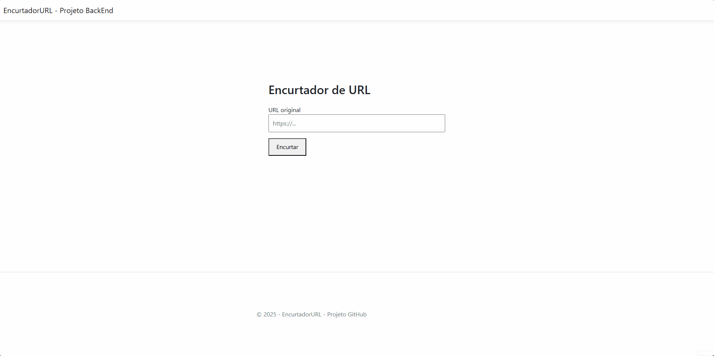

# 🔗 Encurtador de URL - ASP.NET Core MVC + Supabase + Traefik + Docker

Este projeto é um encurtador de URLs com frontend em ASP.NET Core MVC, backend conectado ao Supabase (PostgreSQL), roteamento reverso com Traefik, deploy com Docker e suporte à expiração automática de links.

### Demonstração



---

## ✅ Funcionalidades

- [x] Interface web para encurtar links
- [x] Redirecionamento automático ao acessar `/shortCode`
- [x] Integração com Supabase via Postgrest
- [x] Criação de links únicos com `short_code`
- [x] Armazenamento de data de criação (`created_at`)
- [x] Armazenamento de data de expiração (`expires_at`)
- [x] Remoção automática de links expirados ao abrir a página
- [x] API REST pública para encurtar URLs com `POST /api/shorten`
- [x] Deploy via Docker com Traefik e Docker Compose
- [x] Traefik configurado com domínio local (`short.local`)

---

## 🧱 Tecnologias Utilizadas

- [.NET 8 - ASP.NET Core MVC](https://learn.microsoft.com/aspnet/core)
- [Supabase](https://supabase.com/) (PostgreSQL + API REST)
- [Postgrest C# Client](https://github.com/supabase-community/postgrest-csharp)
- [Docker](https://www.docker.com/)
- [Traefik](https://doc.traefik.io/)
- HTML + Razor Views

---

## 🚀 Como rodar localmente

### ✅ Pré-requisitos:

- Docker e Docker Compose instalados
- Entradas no `hosts` apontando para o domínio local:
- Local do `hosts` - C:\Windows\System32\drivers\etc\

```bash
127.0.0.1 short.local
```

---

### 🔧 Configuração:

1. ✅ Crie um projeto no Supabase  
2. ✅ Crie uma tabela `urls` com as colunas:

| Coluna       | Tipo        | Extras               |
|--------------|-------------|----------------------|
| id           | int8        | Primary Key          |
| codigo       | text        | short_code (único)   |
| url_original | text        | link original        |
| criado_em    | timestamp   | automático            |
| expira_em    | timestamp   | +7 dias do criado_em |

3. ✅ Copie a `SUPABASE_URL` e `SUPABASE_KEY` para o `appsettings.json`

```json
{
  "SupabaseUrl": "https://xxxx.supabase.co",
  "SupabaseKey": "eyJhbGciOiJIUzI1..."
}
```

---

### ▶️ Rodando o projeto:

1. ✅ Compile o projeto:

```bash
docker compose build
```

2. ✅ Rode os serviços:

```bash
docker compose up
```

3. ✅ Acesse o app:

- Interface: http://short.local
- Painel do Traefik: http://localhost:8080

---

## 📌 Estrutura do Projeto

```
/EncurtadorURL
├── Controllers
│   └── HomeController.cs
├── Models
│   ├── HomeModel.cs
│   ├── ShortenViewModel.cs
│   └── ShortenRequest.cs
├── Views/Home
│   └── Index.cshtml
├── Program.cs
├── Dockerfile
├── docker-compose.yml
├── appsettings.json
└── appsettings.Development.json
```

---

## 🧠 Lógica de funcionamento

- `HomeController.Index (GET)`:
  - Carrega a interface e remove links expirados do Supabase
- `HomeController.Index (POST)`:
  - Valida, gera `short_code`, salva no banco e retorna o link encurtado
- `/{shortCode}`:
  - Redireciona para a URL original (se não estiver expirada)
- `api/shorten`:
  - Permite encurtar uma URL via JSON (API externa)

---

## 📦 Docker e Traefik

- Roteamento feito pelo Traefik com domínio `short.local`
- O serviço é exposto na porta `5000` (internamente)
- Reverse Proxy redireciona `http://short.local` via labels no Compose

---

## 🛡️ Segurança

- [x] Tokens antifalsificação com `@Html.AntiForgeryToken`
- [x] Redirecionamento HTTPS (em produção)
- [x] Apenas campos obrigatórios são aceitos

---

## 🔚 Expiração Automática de Links

Ao abrir a tela inicial, todos os links com `expires_at` menor que a data atual são **removidos automaticamente do Supabase**.

---

## 📝 License

Este projeto é open-source e você pode usar livremente com ou sem créditos.

---
